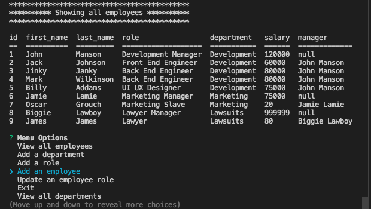

# Employee Manager

[](https://opensource.org/licenses/MIT)

This is a command-line application which allows the user to view and add to the departments, roles, and employees within their company. Employees can also be updated. Each time a department/role/employee is added/updated, it is saved to the database for later use.



### [Demo video](https://watch.screencastify.com/v/N3WUsvqInkiF9KEbY1JH)

## Getting Started

In order to get started, download/clone the repository's contents do your computer, then navigate to the root directory ("employee-manager").

## Prerequisites

You will need Node.js in order to run this application: Download it [here](https://nodejs.org/en/).

Additionally, you will need to install the application's dependencies by running the following command within the root directory:

```
npm install
```

## Using the Application

In order to begin the application, run this command in terminal within the root directory:

```
npm start
```

## Built With

- [NodeJS](https://nodejs.org/en/)
- [MySQL](https://www.mysql.com/)

## Features

- When updating an employee, the user can select from an up-to-date list of employees pulled from the database, as opposed to simply typing in the employee's name

## Author

**Matt Stephens**

- [Link to Portfolio Site](https://mstephen19.github.io/newestPortfolio)
- [Link to Github](https://github.com/mstephen19)
- [Link to LinkedIn](https://www.linkedin.com/mstephen19)

## License

This project is licensed under the MIT License

## Acknowledgments

- Shoutout to [Isaac Hernandez](https://www.linkedin.com/in/cortes-isaac/) for being a great study buddy!
